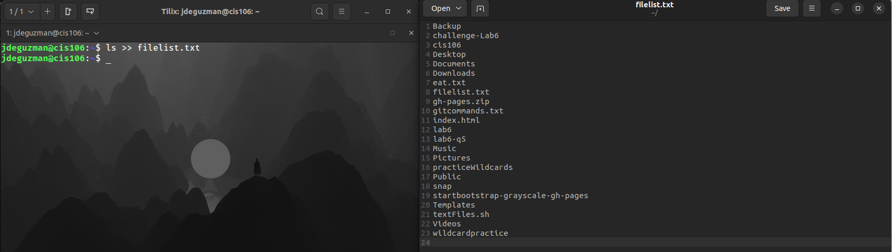

# Question 1

## **awk** 
* **Description:** Awk is a scripting language used for processing a displaying text.
* **Formula:** `awk + options + {awk command} + file`
* **Examples:**
  * **Print the first column of every line of a file:**
    * `awk '{print $1}' ~/Documents/Csv/cars.csv`
  * **Print the last field of a file:**
    * `awk -F: '{print $NF}' /etc/passwd`
  * **Print the first and 3rd field with line numbers:**
    * `awk -F: {print NR,$1,$3}' /etc/passwd`

## **cat**
* **Description:** The cat command is used for displaying the content of a file.
* **Formula:** `cat + option +file(s) to display`
* **Examples:**
  * **Display the content of a file using absolute path:**
    * `cat ~/Documents/todo.lst`
  * **Display the content of a file with line numbers:**
    * `cat -n ~/Documents/todo.lst`
  * **Display the content of a file a $ at the end of every line:**
    * `cat -E ~/Documents/todo.lst`

## **cp**
* **Description:** The cp command copies files/directories from a source to a destination 
* **Formula:** `cp + files to copy + destination`
* **Examples:** 
  * **To copy a file:**
    * `cp Downloads/wallpapers.zip Pictures/`
  * **To copy a directory with absolute path:**
    * `cp -r ~/Downloads/wallpapers ~/Pictures/`
  * **To copy multiple files in a single command:**
    * `sudo cp -r script.sh program.py home.html assets/ /var/www/html/`

## **cut**
* **Description:** The cut command cuts a specific fields from a file.
* **Formula:** `cut + option + file(s)`
* **Examples:**
  * **Display a list of all the users in your system:**
    * `cut -d ':' -f1 /etc/passwd`
  * **Cut a file using a delimiter but changing the delimiter in the output:**
    * `cut -d ':' -f1,7 --output-delimiter=' @ ' /etc/passwd`
  * **Display a list of all the cereals with their number of calories using the delimiter ' calories = ':**
    * `cut -d ';' -f1,4 --output-delimiter=' calories = ' ~/Documents/Csv/cereal.csv`
     
## **grep**
* **Description:** the grep command is used to search text in given file.
* **Formula:** `grep + option + search criteria + file(s)`
* **Examples:**
  * **Search any line that contains the word "dracula" in the given file:**
    * `grep 'dracula' ~/Documents/dracula.txt`
  * **Search any line that contains the word 'dracula' regardless of the case:**
    * `grep -i 'dracula' ~/Documents/Books/dracula.txt`
  * **Search for all the lines that don not contain the word 'war':**
    * `grep -v 'war' ~/Documents/Books/war-and-peace.txt`

## **head**
* **Description:** The head command displays the first 10 lines.
* **Formula:** `head + option + file(s)`
* **Examples:**
  * **Display the first 10 lines of a file:**
    * `head ~/Documents/Books/dracula.txt`
  * **Display the first 5 lines of a file:**
    * `head -5 ~/Documents/Books/dracula.txt`
  * **Display the account information of the first user in your system:**
    * `head -1 /etc/passwd`

## **ls**
* **Description:** The ls command is used for listing the content of a given directory or the file/directory itself.
* **Formula:** `ls + option + directory to list`
* **Examples:**
  * **List all the files inside the current working directory including hidden files:**
    * `ls -a`
  * **List all the files inside a given directory:**
    * `ls -a ~/Pictures`
  * **List all the files in a given directory sorted by file size:**
    * `ls -S ~/Documents`

## **man**
* **Description:** The man command is used to display the user manual of any command given.
* **Formula:** `man + option`
* **Examples:** 
  * **Display the user manual for the ls command:**
    * `man ls`
  * **Display the user manual for the grep command:**
    * `man grep`
  * **Display the user manual for the cut command:**
    * `man cut`

## **mkdir**
* **Description:** The mkdir command is used for creating a single or multiple directories.
* **Formula:** mkdir + the name of the directory
* **Examples:**
  * **Create a directory in the present working directory:**
    * `mkdir wallpapers`
  * **Create multiple directories at once:**
    * `mkdir wallpapers/cars wallpapers/cities wallpapers/forest`
  * **Create a directory with a parent directory at the same time:**
    * `mkdir -p wallpapers_others/movies`

## **mv**
* **Description:** The mv command moves and renames directories. 
* **Formula:** `mv + source + destination`
* **Examples:**
  * **To move a file from a directory to another using relative path:**
    * `mv Downloads/homework.pdf Documents/`
  * **To move multiple directories/files to a different directory:**
    * `mv games/ wallpapers. rockmusic/ /media/student/flashdrive/`
  * **To move and rename a file in the same command:**
    * `mv Downloads/cis106homework.docx Documents/new_cis106homework.docx`

## **tac**
* **Description:** The tac command is used for displaying the content of a file in reverse order.
* **Formula:** `tac + option + file(s) to display` 
* **Examples:**
  * **Display the content of a file located in the pwd:**
    * `tac todo.md`
  * **Display the content of the /etc/passwd file in reverse order:**
    * `tac /etc/passwd`
  * **Display the content of the book dracula in reverse order:**
    * `tac ~/Documents/Books/dracula.txt`

## **tail**
* **Description:** The tail command displays the last  10 lines. 
* **Formula:** `tail + option + file`
* **Examples:**
  * **Display the last 10 lines of a file:**
    * `tail ~/Documents/Books/bible.txt`
  * **Display the account information stored in /etc/passwd of the last user in your system:**
    * `tail -1 /etc/passwd`
  * **Display the last 5 lines of a file:**
    * `tail -5 ~/Documents/Book/dracula.txt`

## **touch** 
* **Description:** The touch command is used for creating files.
* **Formula:** `touch + name of the file`
* **Examples:**
  * **To create several files:**
    * `touch list_of_cars.txt script.py names.csv`
  * **To create a file inside a directory:**
    * `touch assets/image.png`
  * **To create a file with a space in its name:**
    * `touch "list of foods.txt"`

## **tr**
* **Description:** The tr command is used for translating or deleting characters from a standard output.
* **Formula:** `Standard output | tr + option + set + set`
* **Examples:**
  * **Translate one character to another (For example a period with a comma):**
    * `cat file.txt | tr '.' ','`
  * **Translate white space into tabs:**
    * `cat program.py | tr "[:space:]" '\t'`
  * **Translate every period to a exclamation point in bible.txt:**
    * `cat ~/Documents/Books/bible.txt | tr '.' '!'`

## **tree**
* **Description:** The tree command list contents of directories in a tree-like format.
* **Formula:** `tree + directory`
* **Examples:** 
  * **List the files in your cis106 folder using the tree command:**
    * `tree /home/jdeguzman/cis106/`
  * **List the files in your downloads folder using the tree command:**
    * `tree ~/Downloads`
  * **List all the files in your current including hidden files using the tree command:**
    * `tree -a`

# Question 2 

## **How to work with multiple terminals open?**
*   Open the Tilix  terminal and then click the button on the top left to add a new terminal to the right or to the bottom.

## **How to work with manual pages?**
* To access the manual page(s) for a command you type the command "man" followed by the name of the command you want to know about. 
* **Example:**
  * `man ls`
  
## **How to parse (search) for specific words in the manual page**
* To search for a specific word(s) in the manual page you would use the command `man ls | grep "human-readable"`
  
## **How to redirect output (> and |)**
* To redirect and save an output of a file you would use the command `ls -lA ~ > all-files-in-home.txt`
* To redirect standard output you would use the | operator.
  * **Example:**
    * Display only the options  of the ls command from its man page `man ls | grep "^[[:space:]]*[[:punct:]]"`

## **How to append the output of a command to a file**
* To append the output of a command to a file you use >> operator.
* **Example:**  
  * `ls >> filelist.txt` 
    
  * `ls -la > allmyfiles.lst` This command will overwrite whatever is already inside  the file.  

## **How to use wildcards**
*  Wildcards represent letters and characters used to specify a file name for searches.
*   File globbing is the processing of pattern matching using wildcards. 
*   The wildcards are officially called metacharacter wildcards. 
  
### * Wildcard
The * wildcard matches from 0 to any number of characters.
* **Examples:**
  * **List all the text files in a directory:**
    * `ls *.txt`
  * **List all the files that start with the word "file":**
    * `ls file*`
  * **Copy all the mp4 files:**
    * `cp Downloads/*.mp4 ~/Videos/Movies/`
  
### ? Wildcard
The ? Wildcard metacharacter matches precisely one character. 
* **Examples:**
  * **List all the files that have 3 characters and are followed by the word "file" in the name:**
    * `ls ???File*`
  * **List all the files that have a 2 letter extension:**
    * `ls *.??`
  * **List all files that start with the letter p and have a 2 letter extension:**
    * `ls *p?*.??`
  
### [] Wildcard
The [] Wildcard match a single character in a range.
The [] Wildcard use the exclamation mark to reverse the match. 
* **Examples:**
  * **Match all files that have a vowel after  the letter f:**
    * `ls f[aeiou]*`
  * **Match all the files whose name does not have a number in their file name:**
    * `ls *[!0-9].*`
  * **Match all files whose name begins with any 3 combination of numbers and the current user's username:**
    * `ls [0-9][0-9][0-9]$USER`

## **How to use brace expansion**
* The {} expansion is not a wildcard but another feature of bash that allows you to generate arbitrary strings to use with commands.
* **Examples:**
  * **Create a whole directory structure in a single command:**
    * `mkdir -p music/{jazz,rock}/{mp3files,videos,oggfiles}/new{1..3}`
  * **Remove multiple files in a single directory:**
    * `rm -r {dir1,dir2,dir3,file.txt,file.py}`
  * **Create a N number of files:**
    * `touch website{1..5}.html`

