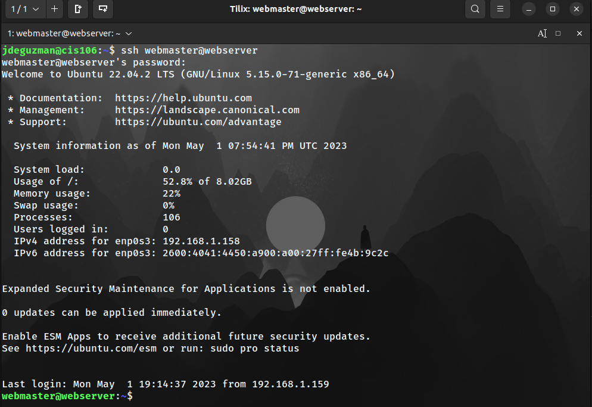
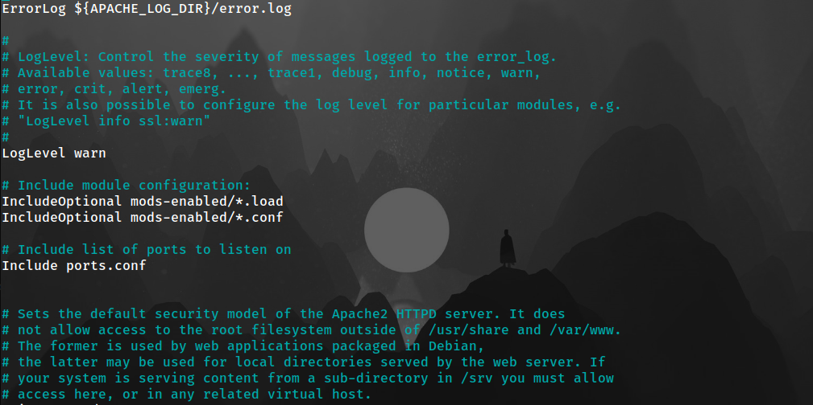

# Deliverable 2

## **Screenshot of the virtual machine hardware configuration**
**Here is a screenshot of the virtual machine hardware configuration:**

## **Screenshot of the login screen**
**Here is a screenshot of the login screen:**

## **Screenshot connecting to the server with ssh**
**Here is a screenshot of connecting to the server with ssh:**

## **Screenshot of commands**
* **Here is a screenshot of the command `systemctl status apache2 --no-pager`:**

* **Here is a screenshot of the command `systemctl status sshd --no-pager`:**

* **Here is a screenshot of the command `systemctl status ufw --no-pager`:**

## **Screenshots of the last 10 lines of the following log files**
* **Here is a screenshot of Apache access logs:**

* **Here is a screenshot of Apache error logs:**

* **Here is a screenshot of SSH auth logs:**

## **Screenshot of the following configuration**
* **Here is a screenshot of the sites-available config file:**

* **Here is a screenshot of the apache2.config file:**

## **Screenshot of the ip address and website being accessed**
* **Here is a screenshot of the ip address and the website:**
