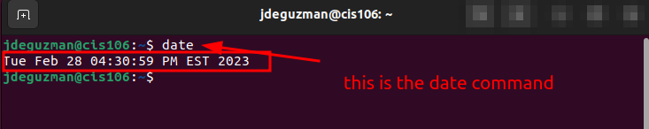
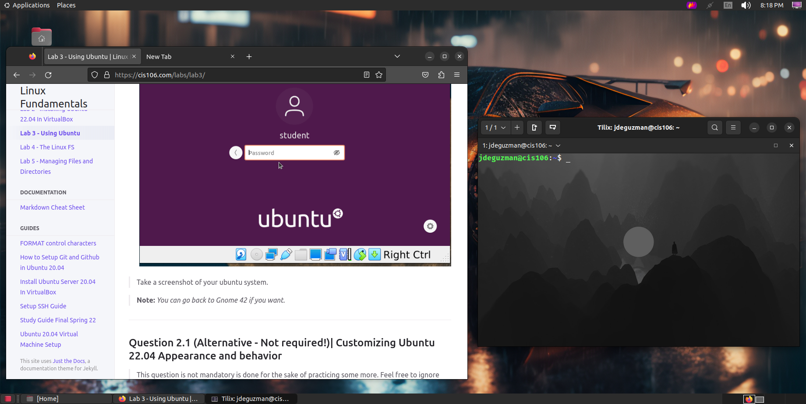

# Lab 3 Submission

## Question 1 

## Question 2

## Question 3

| Program purpose     | Package Name     | Version                            |
| ------------------- | ---------------- | ---------------------------------- |
| Play a tetris game  | blockattack      | 2.7.0-1                            |
| Play a video file   | dragonplayer     | 4:21.12.3-0ubuntu1                 |
| Browse the internet | epiphany-browser | 42.4-0ubuntu1                      |
| Read your email     | geary            | 40.0-2                             |
| Play music          | clementine       | 1.4.0~rc1+git347-gfc4cb6fc7+dfsg-2 |

## Question 4

| Command | What It Does                                                                                                  |
| ------- | ------------------------------------------------------------------------------------------------------------- |
| echo    | it displays a line of text                                                                                    |
| fortune | prints a random, hopefully interesting, adage                                                                 |
| cowsay  | it generates a ASCII art picture of a cow with a message                                                      |
| lolcat  | it displays the console in rainbow coloring effect                                                            |
| figlet  | it prints the user input using large text banners                                                             |
| toilet  | it prints large characters made up of smaller characters                                                      |
| rig     | it will print out a random identity generator, and you can choose to decide if you want a female or male name |

