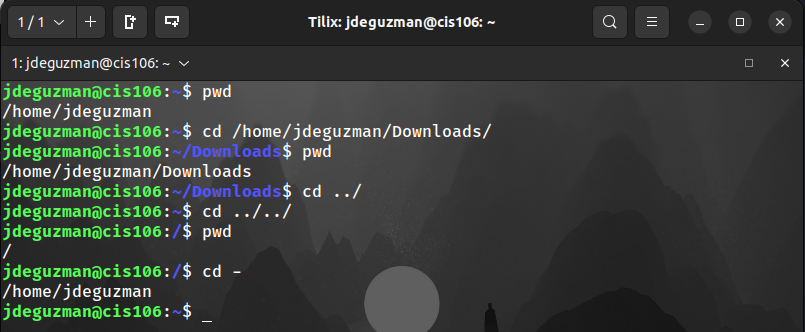
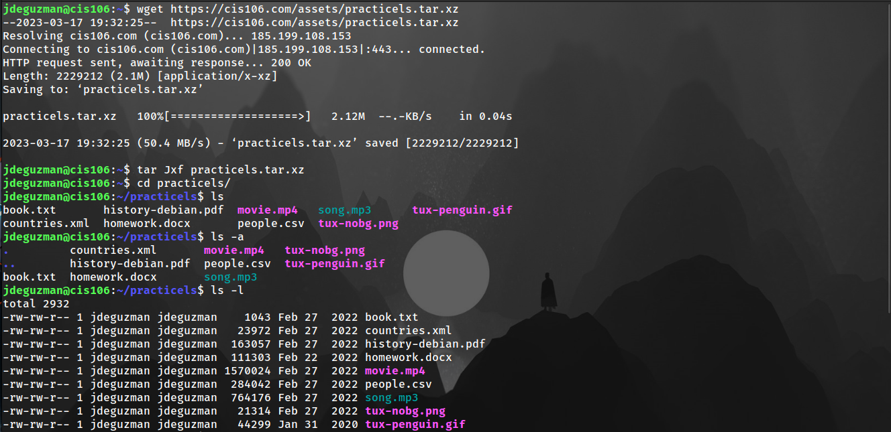
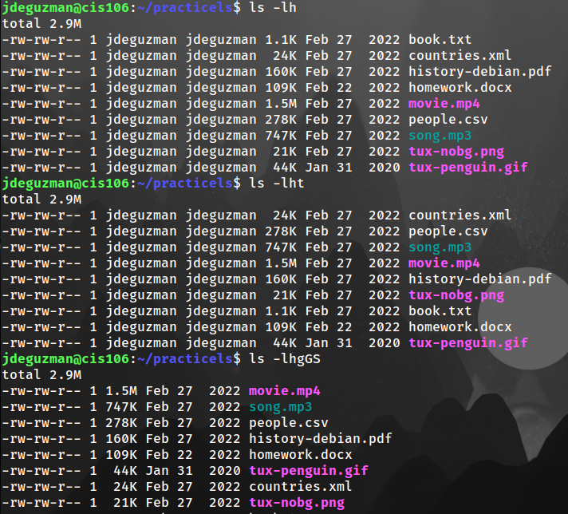
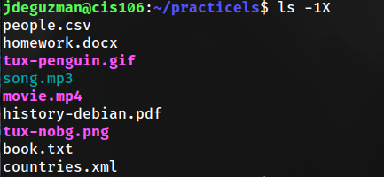
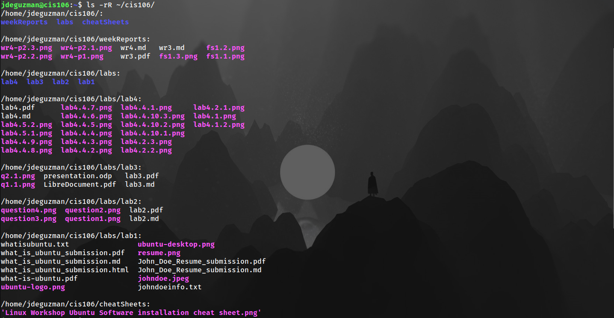
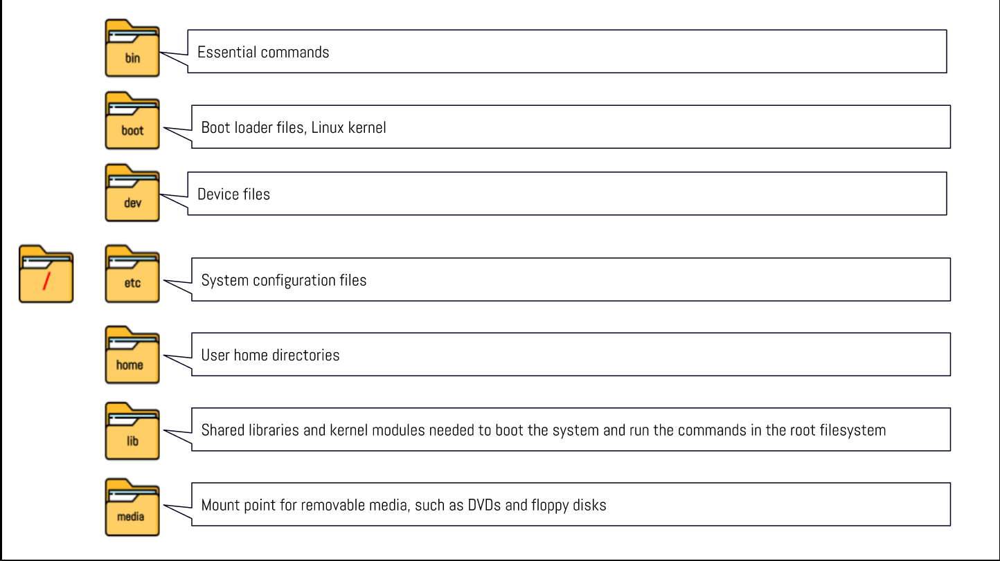
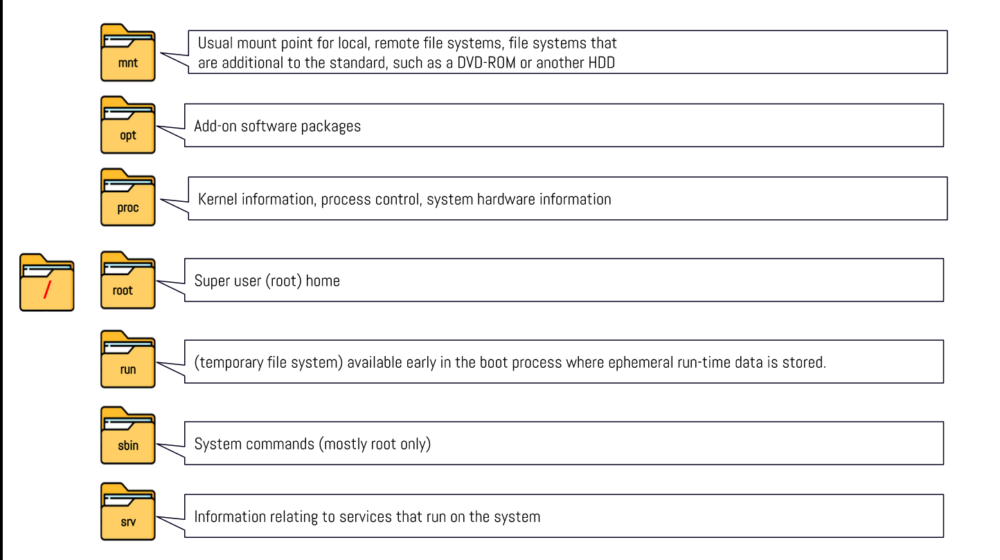
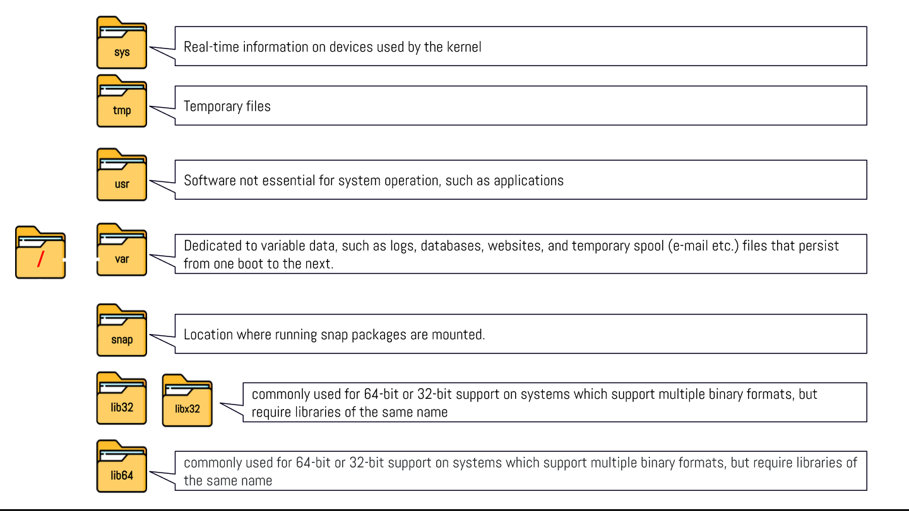

# Week Report 4

## Practice from the presentation The Linux File System
### Practice 1

### Practice 2

### Practice 3

## The Linux File system directories and their purpose

## All the commands for navigating the filesystem 

| Command | What it does                                    | Syntax                  | Example        |
| ------- | ----------------------------------------------- | ----------------------- | -------------- |
| pwd     | prints out the current directory                | pwd                     | `pwd`          |
| cd      | changes the current working directory           | cd + destination        | `cd Downloads` |
| ls      | displays all the files inside a given directory | ls + option + directory | `ls`           |

## Basic terminology 

* **File system:** The way files are stored and organized. Linux uses the **hierarchical directory structure**(tree-like pattern of folders).
* **Current directory:** The directory where you are at the moment; also called the present working directory. 
* **Parent directory:** A directory above another directory; 
* **the difference between your home directory and the home directory:** Your home directory is your current working directory, every user in the system has their own home directory.  The home directory is the root directory which the administrator of your system
* **Pathname:** The pathname indicates the location of the file in the filesystem (like an address).
* **Relative path:** The location of a file starting from the current working directory or a directory that is located inside the current working directory.
  * **Example:** `Downloads/song.mp3`
* **Absolute path:** The location of a file starting at the root of the file system.
  * **Example:** `/home/user/Downloads/` 
