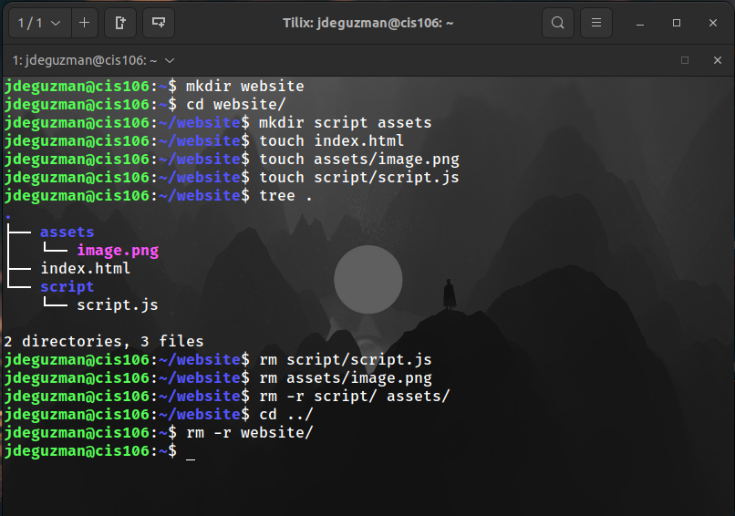
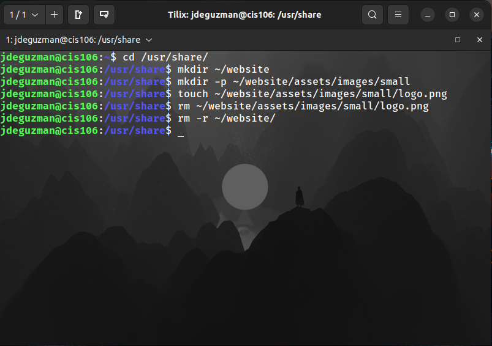
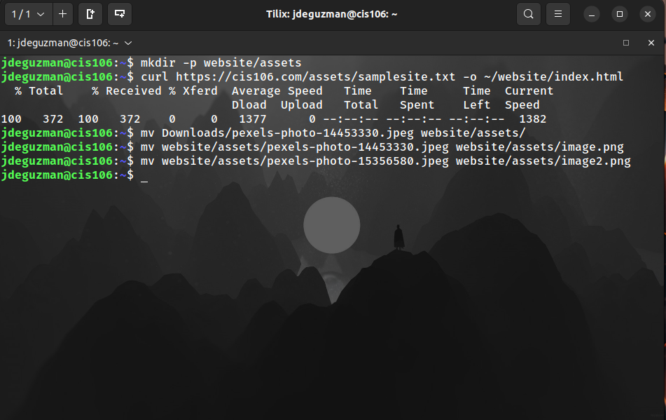
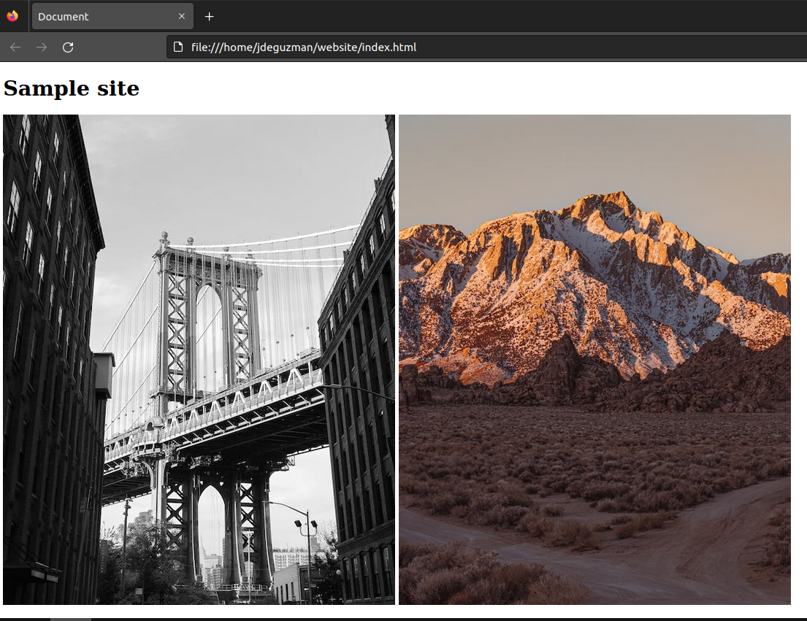
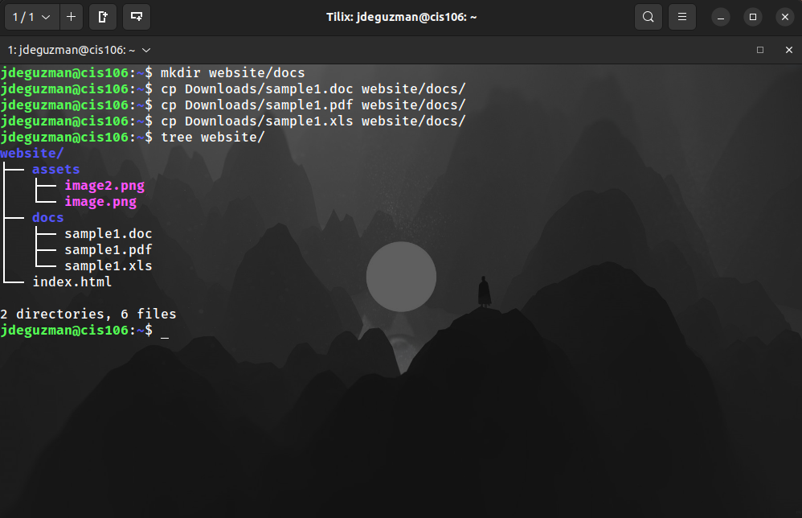

# Week Report 5

## Answer to Questions:

* **What are Command Options?**
Commands are often followed by options that modify/enhance their behavior.
* **What are Command Arguments?**
Commands are also followed by arguments which are the items open which the command acts on.  
* **Which command is used for creating directories? Provide at least 3 examples.**
The command that is used for creating directories is mkdir.
  * Example 1: 
    * Create a directory: `mkdir potatoes`
  * Example 2:
    * Create multiple directories: `mkdir movies ~/Downloads/games ~/Documents/hmw`
  * Example 3:
    * Create a directory with a parent directory at the same time: `mkdir -p wallpapers_others/movies`   

* **What does the touch command do? Provide at least 3 examples.**
It is used for creating files.
  * Example 1:
    * Create a file called list: `touch list`
  * Example 2:
    * Create a file using absolute path: `touch ~/Downloads/games.txt`
  * Example 3:
    * Create several files: `touch list_of_cars.txt script.py names.csv`  
* **How do you remove a file? Provide an example.**
To remove a file use the command rm.
  * Example: 
    * Remove a file: `rm list` 
* **How do you remove a directory and can you remove non-empty directories in Linux? Provide an example**
To remove a directory use the command rmdir. To remove a non-empty directory use the command `rm -r Downloads/games`   
* **Explain the mv and cp command. Provide at least 2 examples of each**
The mv command moves and renames directories.
  * Example 1:
    * To move a file from a directory to another using relative path: `mv Downloads/homework.pdf Documents/`
  * Example 2:
    * To move and rename a file in the same command: `mv Downloads/cis106homework.docx Documents/new_cis106homework.docx`    

  The cp command copies files/directories from a source to a destination.
  * Example 1:
    * To copy a file: `cp Downloads/wallpapers.zip Pictures/`
  * Example 2:
    * To copy multiple files in a single command: `sudo cp -r script.sh program.py home.html assets/ /var/www/html/`       

## Practice 1

## Practice 2

## Practice 3

## Practice 4
