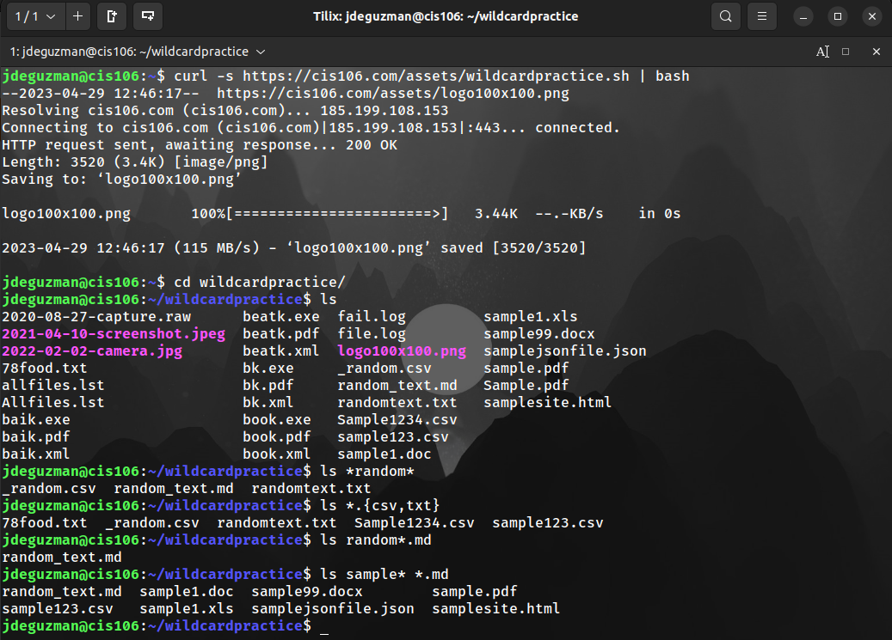
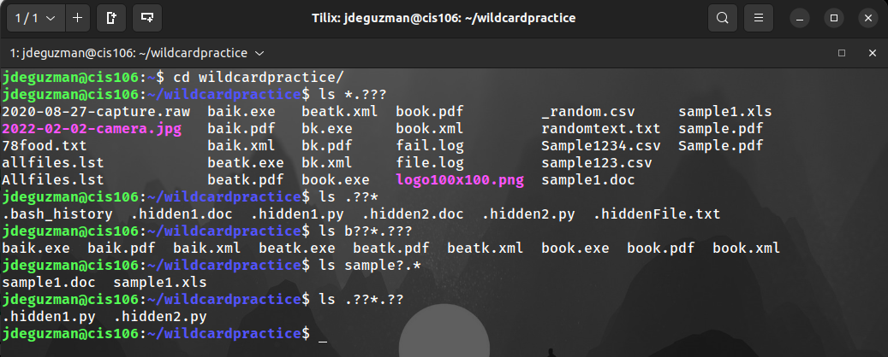
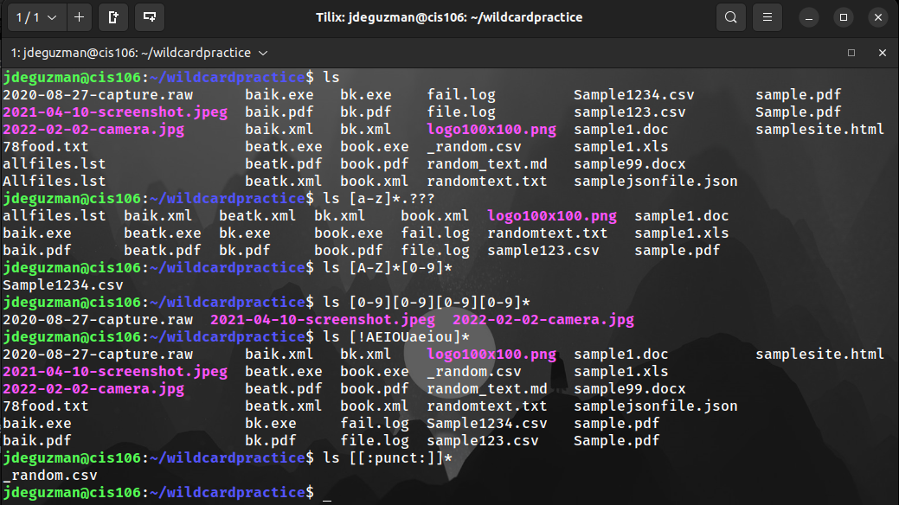

# Week Report 6 

## Wildcards
*   Wildcards represent letters and characters used to specify a file name for searches.
*   File globbing is the processing of pattern matching using wildcards. 
*   The wildcards are officially called metacharacter wildcards. 
  
### * Wildcard
The * wildcard matches from 0 to any number of characters.
* **Examples:**
  * **List all the text files in a directory:**
    * `ls *.txt`
  * **List all the files that start with the word "file":**
    * `ls file*`
  * **Copy all the mp4 files:**
    * `cp Downloads/*.mp4 ~/Videos/Movies/`
  
### ? Wildcard
The ? Wildcard metacharacter matches precisely one character. 
* **Examples:**
  * **List all the files that have 3 characters and are followed by the word "file" in the name:**
    * `ls ???File*`
  * **List all the files that have a 2 letter extension:**
    * `ls *.??`
  * **List all files that start with the letter p and have a 2 letter extension:**
    * `ls *p?*.??`
  
### [] Wildcard
The [] Wildcard match a single character in a range.
The [] Wildcard use the exclamation mark to reverse the match. 
* **Examples:**
  * **Match all files that have a vowel after  the letter f:**
    * `ls f[aeiou]*`
  * **Match all the files whose name does not have a number in their file name:**
    * `ls *[!0-9].*`
  * **Match all files whose name begins with any 3 combination of numbers and the current user's username:**
    * `ls [0-9][0-9][0-9]$USER`

## Brace Expansion
The {} expansion is not a wildcard but another feature of bash that allows you to generate arbitrary strings to use with commands.
* **Examples:**
  * **Create a whole directory structure in a single command:**
    * `mkdir -p music/{jazz,rock}/{mp3files,videos,oggfiles}/new{1..3}`
  * **Remove multiple files in a single directory:**
    * `rm -r {dir1,dir2,dir3,file.txt,file.py}`
  * **Create a N number of files:**
    * `touch website{1..5}.html`

## Practice 

**Practice 5:**

**Practice 6:**

**Practice 7:**
